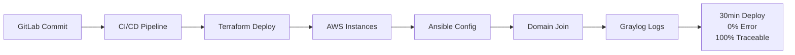

# AutoJoin Pipeline

> Automating domain join for multi-OS environments using modern DevOps practices

## Overview

AutoJoin Pipeline is a comprehensive automation solution that transforms manual domain join operations into a reliable, traceable, and error-free process. This project demonstrates the integration of GitLab CI/CD, Terraform, Ansible, and Graylog to deliver infrastructure automation at scale.

**Problem**: Traditional domain join processes require 2-3 days of manual work with 15-20% error rates  
**Solution**: 30-minute automated deployments with 0% error rate and complete traceability

## Architecture



## Technology Stack

- **GitLab CI/CD** - Pipeline automation and DevSecOps
- **Terraform** - Infrastructure as Code for AWS provisioning
- **Ansible** - Multi-OS configuration management and domain join
- **Graylog** - Centralized logging and observability
- **Mermaid** - Documentation as Code with visual diagrams

## Repository Structure

```
autojoin-pipeline/
├── terraform/          # Infrastructure as Code
│   ├── modules/         # Reusable Terraform modules
│   └── environments/    # Environment-specific configurations
├── ansible/            # Configuration management
│   ├── playbooks/      # Automation playbooks
│   └── roles/          # Reusable Ansible roles
├── gitlab-ci/          # CI/CD pipeline definitions
├── docs/               # Documentation and learning notes
└── README.md          # This file
```

## Getting Started

### Prerequisites

- AWS Account with appropriate permissions
- GitLab account (GitLab.com or self-hosted)
- Terraform >= 1.0
- Ansible >= 2.9
- Domain Controller accessible from AWS VPC

### Quick Start

1. **Clone the repository**
   ```bash
   git clone https://github.com/diegobroetto/autojoin-pipeline.git
   cd autojoin-pipeline
   ```

2. **Configure AWS credentials**
   ```bash
   aws configure
   ```

3. **Set up Terraform backend** (Update `terraform/backend.tf`)
   ```hcl
   terraform {
     backend "s3" {
       bucket = "your-terraform-state-bucket"
       key    = "autojoin/terraform.tfstate"
       region = "us-east-1"
     }
   }
   ```

4. **Deploy infrastructure**
   ```bash
   cd terraform
   terraform init
   terraform plan
   terraform apply
   ```

> **Note**: Detailed setup instructions will be provided as each phase is completed.

## Learning Journey

This project serves as a hands-on learning laboratory for modern DevOps technologies. Each phase is documented with:

- Learning objectives and outcomes
- Challenges faced and solutions found
- Code examples with detailed explanations
- Best practices discovered
- Resources that helped the most

### Article Series

1. **AutoJoin Series #1**: Learning GitLab CI/CD - From Basic Pipelines to DevSecOps
2. **AutoJoin Series #2**: Ansible for Infrastructure - Multi-OS Automation Journey
3. **AutoJoin Series #3**: Graylog Deep Dive - Building Comprehensive Log Management
4. **AutoJoin Series #4**: Integration Patterns - Connecting GitLab, Ansible, and Graylog
5. **AutoJoin Series #5**: Lessons Learned - From Learning Project to Production-Ready Solution

## Contributing

This is a learning project, but contributions, suggestions, and feedback are welcome! Please:

1. Fork the repository
2. Create a feature branch
3. Make your changes
4. Submit a pull request

## License

This project is licensed under the MIT License - see the [LICENSE](LICENSE) file for details.

## Connect

- **LinkedIn**: [linkedin.com/in/diegobroetto](https://linkedin.com/in/diegobroetto)
- **Medium**: [Follow the article series](#) (link to be updated)
- **Email**: [diego.broetto@example.com](mailto:diego.broetto@example.com)

---

⭐ **Star this repository if you find it helpful for your DevOps learning journey!**